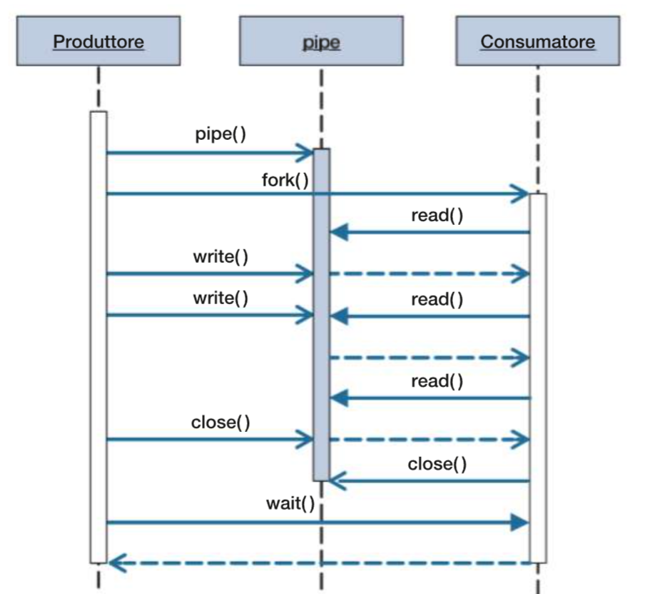

## Giovedì 11/04/24



**1.** Accedere al proprio repository remoto Git.

**2.** Clonarlo sul desktop.
```
cd <path-to-Desktop>
git clone <link-repository>
```

**3.** Posizionarsi nella cartella appena creata.
```
cd <path-to-current-directory>
```

**4.** Se è già presente il repository locale sul pc, sincronizzare il contenuto con il repository remoto
```
git pull origin main
```

**5.** Implementare quanto richiesto su [Classroom](https://classroom.google.com/c/NjIyOTM1MTcxOTI2/a/NjczNDk2MjEwNzM4/details).

In un file di testo, inserire un breve questionario da sottoporre successivamente ai compagni o ai docenti (può servire a verificare la propria conoscenza su materie di studio, può riguardare curiosità, hobby, ecc.) e rinominarlo origine.txt.
Copiare il contenuto del file pipe.c all'interno di un file vuoto .c creato in precedenza, in modo tale da implementare le seguenti specifiche:
1) il produttore copia nella pipe il contenuto nel file di origine,
2) il consumatore legge una riga alla volta il contenuto della pipe e, per ogni riga:

2-1) copia il contenuto in un file di destinazione di testo,

2-2) gestisce l'acquisizione della risposta mediante input da tastiera,

2-3) scrive sul file destinazione.txt la risposta alla domanda del questionario.

Inserire come primo argomento da riga di comando il nome del file, assicurandosi che si trovi nel workspace.
Inserire come secondo argomento da riga di comando il nome del file di destinazione destinazione.txt.

Eseguire il programma e provare a risolvere eventuali bug.

**6.** Aggiornare lo stage.
```
git add <nome-file>
```

**7.** Sincronizzare il repository locale con il contenuto dello stage associando all'operazione il messaggio specificato.
```
git commit -m "Implementazione pipe con salvataggio su file in C"
```

**8.** Sincronizzare il branch (main) del repository remoto specificato con il contenuto del repository locale.
```
git push origin main
```

**9.** Assicurarsi che il repository remoto sia aggiornato.

**10.** Scrivere il link del proprio repository remoto come commento al compito su Classroom.
