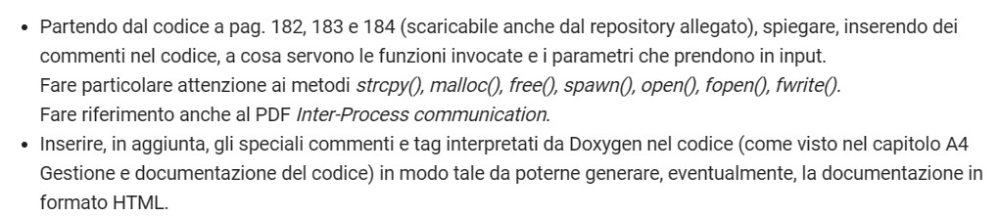

## Giovedì 21/03/24

Chi ha svolto l'esercitazione di giovedì 14, può saltare alcuni passaggi e passare direttamente al punto 8.

**1.** Aprire Git bash.

**2.** Posizionarsi nella cartella su cui si vuole lavorare.

Esempio:
```
cd <path-to-Desktop>
```
dove \<path-to-Desktop\> va sostituito con il percorso del Desktop.

**3.** Clonare il repository corrente.
```
git clone https://github.com/rosarusso/DB-4ITI-codice-dispense.git
```

**4.** Copiare il contenuto della cartella **cB1_p182** in una nuova cartella, che userete per il progetto da consegnare su Classroom.

**N.B.:** Il testo compreso tra "\<" e "\>" va sempre sostituito con ciò che è indicato all'interno (eliminando le parentesi uncinate). Ad esempio, "\<nuova-cartella\>" potrebbe diventare "21-03".
```
mkdir <nuova-cartella>
cp DB-4ITI-codice-dispense/cB1_p182/* <nuova-cartella>
```

**5.** Andare nella cartella appena creata.
```
cd <nuova-cartella>
```

**6.** Inizializzazione del nuovo repository locale e aggiunta dell’indirizzo del repository remoto nel repository locale (in modo da collegare i due repository).
```
git init -b main
git remote add origin <link-al-tuo-repository>
```
È possibile utilizzare il repository creato durante l'ultima lezione.

**7.** Sincronizzare la cartella attuale con il contenuto del repository remoto specificato, se quest'ultimo non è vuoto.
```
git pull origin main
```
Nel caso di un repository remoto vuoto, eseguendo ugualmente il comando pull, questo restituirà un errore che è possibile ignorare.

**8.** A questo punto è possibile modificare i file come richiesto dalla traccia su Classroom.


**9.** Sincronizzare il repository remoto con il workspace su cui avete lavorato localmente.
```
git add <nome-file-modificati>
git commit -m "<descrizione-delle-modifiche-effettuate>"
git push origin main
```